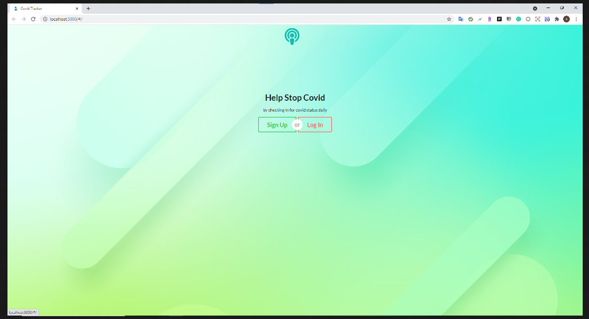

Pokemon game is a word based pokemon battle game that is based on the famous nintendo game series pokemon. In this
project, I inserted some pokemons data and simulates a fight between them. It compares its attack power, health and
type the pokemon have. The essential goal is to defeat the opponnet's pokemon by attacking it until the pokemon's
health reach to 0

Source: <a href="https://github.com/Lam-Tech/covid-tracker"><i class="large github icon "></i>Covid Chcker</a>
