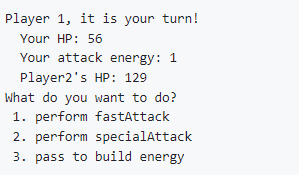

Pokemon game is a word-based Pokemon battle game that is based on the famous Nintendo game series Pokemon. In this
project, I inserted some Pokemon data and simulated a fight between them. It compares its attack power, health, and
type the Pokemon have. The essential goal is to defeat the opponent's Pokemon by attacking it until the Pokemon's
health reaches 0.

## difficulties and take away
This project is very challenging to me at that time because you have to follow all these guidelines and collaborate with all these data. However, when the final project comes out,
All I felt was proud, even though it was just a small mini-game. I felt there was an energy coming from my atmosphere that this was the thing I wanted to do. I also learned many with this project,
for example, the coding skills and the ability to work with teams and collaborate with people. 

Source: <a href="https://github.com/ICSatKCC/a5-pokemon-battle-game-f20-group-3-3/tree/develop"><i class="large github icon "></i>Pokemon Game</a>
