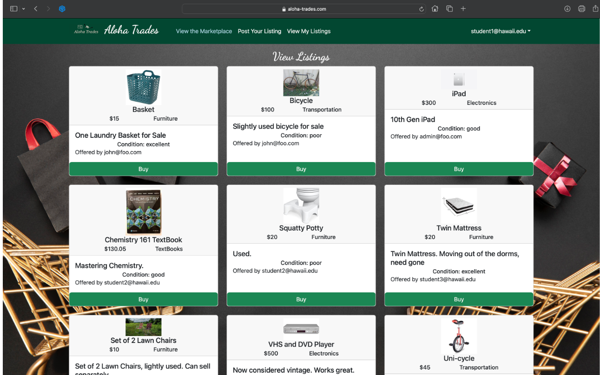

## Purpose:

The inception of our project was steered by the distinct requirements articulated by our client. They sought a final project that mandated the utilization of a meteor-react template, 
coupled with the creation of an exclusive flea market webpage designed specifically for students. This platform, akin to Craigslist but with more stringent parameters, would 
facilitate transactions exclusively among the University of Hawaii's student and faculty community. The rationale behind this initiative stemmed from the common need among 
students and faculty to part ways with gently used items as they transition out of dorms or conclude academic semesters.

The project prompt prompted us to tailor the template by implementing specific limitations. We aimed for a streamlined selection of item categories and restricted user 
sign-ups to those possessing @hawaii.edu email domains. To ensure the platform's integrity, we instituted a meticulous review and approval process overseen 
by an administrator. This measure was implemented to safeguard against the display of inappropriate or unauthorized listings, offering users a curated and reliable experience.

## My participation

In this project, I played a pivotal role in shaping the project's overall vision and concept, contributing significantly to the formulation of key ideas. I took an active part 
in crafting a concise and compelling project summary. Moreover, I applied my expertise by editing CSS files to enhance the project's visual appeal, specifically focusing on 
refining background colors and overall aesthetics for better clarity. Additionally, I addressed and resolved server-related issues and refined the user interface. Notably, 
I spearheaded the creation of a user listing page, further enhancing the project's functionality and user experience.

## Learning outcomes

Early in our project, we quickly grasped the importance of meticulous planning and maintaining alignment within our team while developing our webpage. Initially, 
everyone enthusiastically delved into coding after the first day of the assignment, only to discover upon regrouping that each team member harbored a distinct 
vision for key elements such as listings, purchasing mechanisms, and sign-in procedures. The divergence in ideas led to a realization that our initial code was 
incompatible, necessitating a significant overhaul.

To address this challenge, we adopted an Agile Project Management workflow. Our first step involved collaboratively constructing a flowchart to map out the
desired user experience. This exercise proved invaluable in establishing a shared understanding of the project's direction. Subsequently, we systematically 
divided tasks into manageable milestones. Communication became paramount as we consistently updated everyone on ongoing and completed changes. Through this Agile 
approach, we not only rectified initial disparities but also fostered a more cohesive and adaptable development process.

Source: <a href="https://aloha-trades.com">Project Website</a>
Source: <a href="https://aloha-trades.github.io/">Organization Website</a>
Source: <a href="https://github.com/aloha-trades">Github Website</a>
